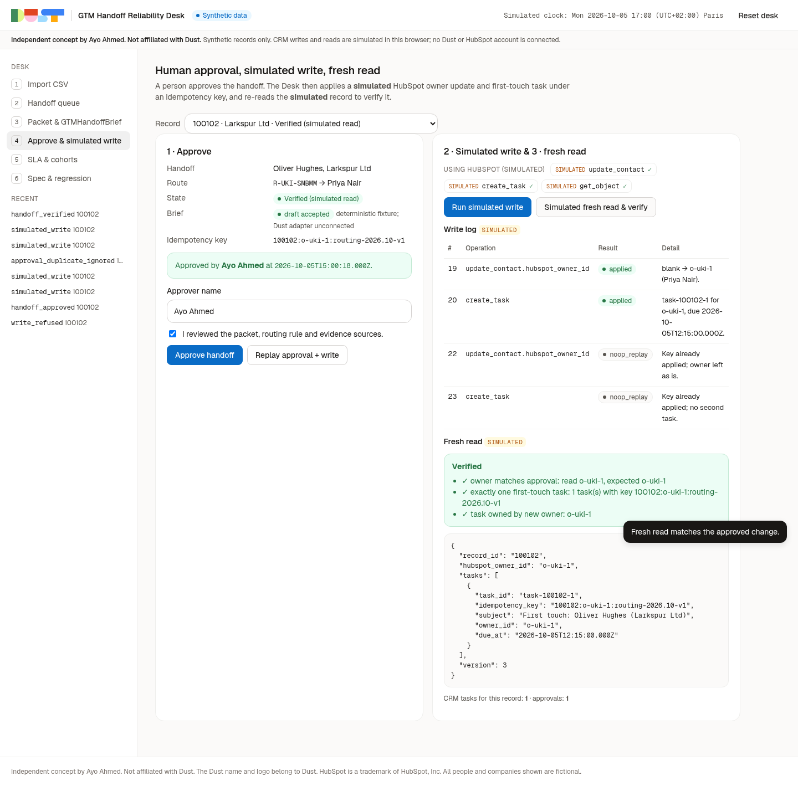

<p> &nbsp;<strong>Independent concept by Ayo Ahmed. Not affiliated with Dust.</strong></p>

# GTM Handoff Reliability Desk

An independent audition concept by Ayo Ahmed for Dust's Revenue Operations role. It shows how a RevOps owner could run Dust's existing HubSpot read/write capability safely on SQL handoffs. It does not add a platform capability and does not report any Dust defect. **All data is synthetic. CRM writes and reads are simulated in the browser. No Dust or HubSpot account is connected.**

- **Docs (PM + technical package):** [docs/README.md](docs/README.md)
- **Test results (actual output):** [docs/20-test-evidence.md](docs/20-test-evidence.md)
- **Native agent contract (GTMHandoffBrief):** [docs/dust-agent/](docs/dust-agent/)

## The loop

```text
CSV import → row validation → stable-ID dedupe / conflict detection → territory × segment routing
→ evidence gate → source-backed packet → GTMHandoffBrief draft (pasted in, validated) → human approval
→ idempotent simulated HubSpot write → simulated fresh read + verification → SLA / cohort report
→ reproducible spec + regression case
```

- Duplicates merge **only** on `record_id`. Same name or same email across IDs goes to review.
- A qualified lead with no owner is routed by an explicit rule (`R-DACH-ENT` → `o-dach-2`). Unknown territory is refused.
- Conflicting ownership goes to a person. The Desk never reassigns.
- Missing, stale (> 14 days) or future evidence blocks the handoff and lists the fields.
- A second approval is ignored; a replayed write is `noop_replay`. One assignment, one task.
- SLA: 4 working hours in the owner's timezone, DST and weekends included.
- Cohort report: overall conversion rises 17.5% → 30.75% while every source falls. The Desk says "Mix shift, not improvement" and claims no impact.
- Agent replies are checked for JSON shape, packet ID, source IDs, owner and refusal rules. Built-in examples are labelled **"deterministic fixture; Dust adapter unconnected"**; pasted replies are labelled "pasted response · provenance not verified". Three native GTMHandoffBrief preview replies (normal, missing evidence, ownership conflict) captured in Ayo's workspace pass the validator: [docs/evidence/native-replies](docs/evidence/native-replies/README.md).



## Run locally

```bash
npm ci
npm run check                     # typecheck + unit tests + build
npm run serve                     # http://127.0.0.1:8787
CHROME_PATH=/path/to/chrome npm run test:e2e
CHROME_PATH=/path/to/chrome npm run test:a11y
CHROME_PATH=/path/to/chrome npm run test:responsive   # 390px + 768px, all views
npm run build:pages               # static site in dist-pages/
```

Deployment is a manual GitHub Pages workflow: [docs/deploy-github-pages.md](docs/deploy-github-pages.md).

## Layout

```text
src/engine/  csv · policy · time · pipeline · desk · dust · cohort · spec · sample
src/ui/      main.ts
public/      index.html · styles.css · tokens.css · brand/ · fonts/
test/        Vitest
scripts/     serve · build-pages · e2e · a11y · responsive
docs/        PM + technical package, brand, agent contract, evidence
```

## Brand and notices

The [brand sheet](BRAND_SHEET.md) and [visual guide](docs/brand/visual-guide.png) were written before the app code. The Dust name and logo belong to Dust and are used unmodified only to show product fit. See [NOTICE.md](NOTICE.md).

Concept and product: Ayo Ahmed. Code under the MIT licence ([LICENSE](LICENSE)).
